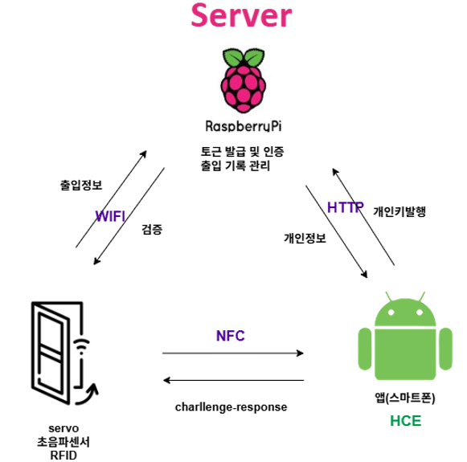
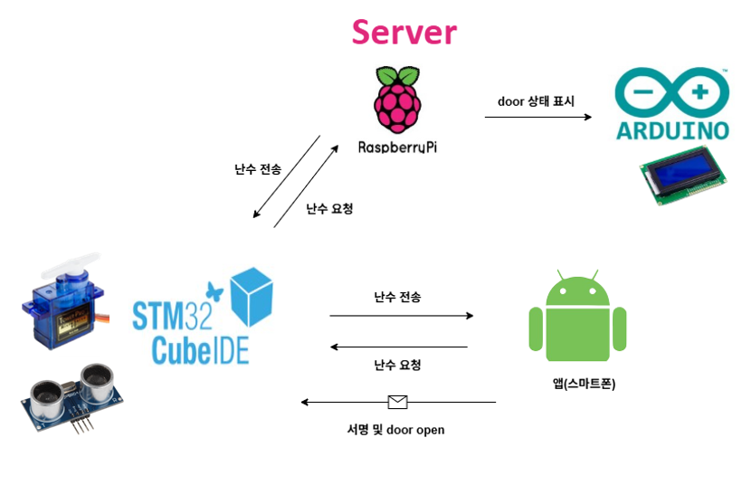

# Smart-Doorlock
휴대폰 NFC 기반 출입 인증 & 보안 통신 로직

##  개요
스마트폰 **NFC 태깅**으로 도어락을 열기 위해, 도어락-서버-사용자 간 **보안 통신 로직**을 설계하고 구현했습니다.  
NFC의 메시지 길이/전송 안정성 제약을 고려해, 메시지 분할(Chunk) 처리와 식별자 노출 최소화 전략을 적용했습니다.

---

##  문제 정의
- 비밀번호 노출로 인한 공동현관 보안 위험
- 카드 등의 하드웨어로 발행된 출입키는 관리 부담이 있음
- 스마트폰 NFC를 통한 인증으로 통합 관리

---

##  시스템 아키텍처
- 통신 시스템
  
- 보안 시스템
  

---

##  핵심 구현: 보안 통신 로직

###  토큰 발행 및 인증 시 Nonce & Challenge
- 핸드폰에서 사용자 가입 후 토큰을 발행해서 핸드폰에 토큰 저장
- 인증 시 Nonce(난수)를 발행하고 핸드폰 토큰으로 서명
- 서명된 정보를 서버에서 검증
  
###  Chunk 기반 메시지 분할 전송
- 메시지를 **64바이트 Chunk 단위로 분할**해 통신하고, 수신 측에서 이를 조합하여 처리  
- 목적: NFC 메시지 길이 제약 및 길이로 인한 불안정성 완화

---

##  도어락 동작 기능
- 문 주변 감지 및 문 닫힘 자동화(센서/서보 제어) 기능도 포함
  
---

##  트러블슈팅
- **NFC 메시지 길이로 인한 불안정성** 이슈를 고려해
  - 메시지 분할(Chunk) 및 처리 로직을 적용
  - 통신 안정성을 확보하는 방향으로 개선

---

##  느낀 점
통신 제약이 있는 환경(NFC)에서 **메시지 설계/분할 처리**와 **식별자 보호 관점의 보안 설계**를 직접 경험하며,
수업에서 배운 내용을 실전 프로젝트로 확장하는 과정에서 많은 것을 학습했습니다.
